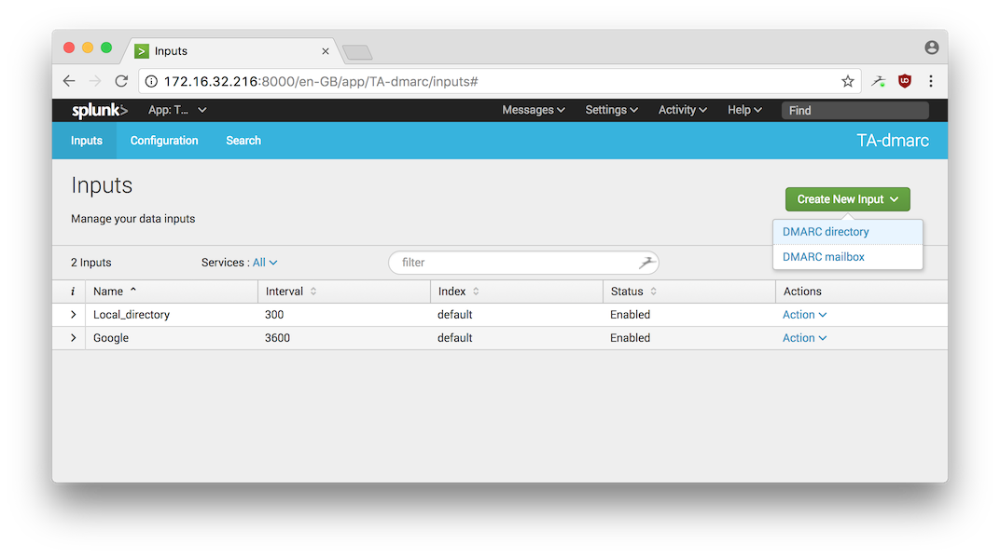
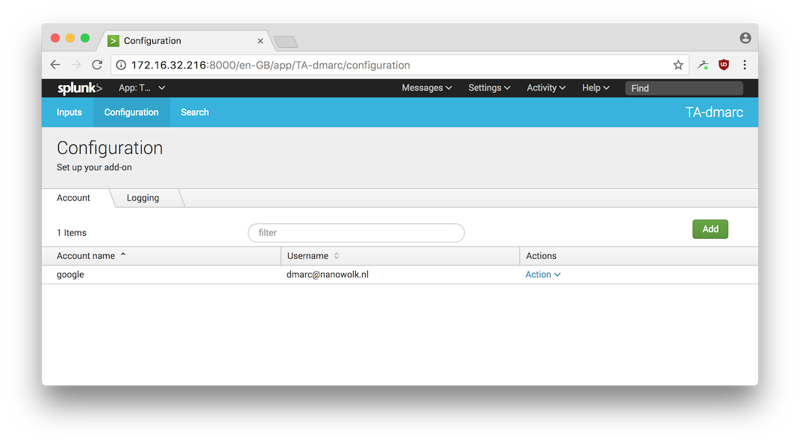

# TA-dmarc add-on for Splunk

Add-on for ingesting DMARC XML aggregate reports into Splunk from an IMAP account or local directory, with mitigations against XML, GZ and ZIP-bombs. 

## Supported versions and platforms

| Splunk version | Linux | Windows
|----------------|-------|---------
| 6.3            | Yes   | Yes
| 6.4            | Yes   | Yes
| 6.5            | Yes   | Yes
| 6.6            | Yes   | Yes
| 7.0            | Yes   | Yes

Additional requirements:

* Splunk heavy forwarder instance: Because of Python dependencies Splunk Universal Forwarder is not supported
* KVstore: used for checkpointing mails-seen-on-IMAP. KVstore is enabled by default on Splunk instances,

## Install the TA-dmarc add-on for Splunk

### Single instance Splunk deployments

1. In Splunk, click on "Manage Apps"
2. Click "Browse more apps", search for "TA-dmarc" and install the add-on

### Distributed Splunk deployments

| Instance type | Supported | Required | Description
|---------------|-----------|----------|------------
| Search head   | Yes       | Yes      | Install this add-on on your search head(s) where CIM compliance of DMARX aggregate reports is required
| Indexer       | Yes       | No       | This add-on should be installed on a heavy forwarder that does the index time parsing. There is no need to install this add-on on an indexer too.
| Universal Forwarder | No  | No       | This add-on is not supported on a Universal Forwarder because it requires Python
| Heavy Forwarder     | Yes | Yes      | Install this add-on on a heavy forwarder to ingest DMARC XML aggregate reports into Splunk.

The following table lists support for distributed deployment roles in a Splunk deployment:

| Deployment role | Supported | Description
|-----------------|-----------|-------------
| Search head deployer | Yes  | Install this add-on on your search head deployer to enable CIM compliance of DMARC aggregate reports on a Search Head Cluster
| Cluster Master       | No  | This add-on should be installed on a heavy forwarder that performs parsing at index time. There is no need to install this add-on on an indexer too.
| Deployment Server    | Yes  | Install this add-on on your Deployment Server to deploy it to search heads and heavy forwarders.

## Configure inputs for TA-dmarc



### Directory input

TA-dmarc can watch a folder where you drop DMARC aggregate reports manually or otherwise.
It will process files with .xml, .zip or .xml.gz extension, ingest them into Splunk, and move them to the done/ directory after succesful processing. Any invalid .xml, .zip or .xml.gz files are moved to the bad/ directory.

1. Go to the add-on's configuration UI and configure a new modular input by clicking on the "Inputs" menu.
2. Click "Create new input"
2. Select "DMARC directory"
3. Configure:
   * Name: e.g. "production_dmarc_indir"
   * Interval: how often to poll the directory where DMARC XML aggregate reports are dropped (see below)
   * Index: what Splunk index to send the aggregate reports to
   * Directory: Location where DMARC aggregate report files are dropped
   * Quiet time: Ignore files that have a modification time of less than n seconds ago. You can use this to prevent ingesting large files that are dropped on a share but take some time to transfer
   * Resolve IP: Whether or not to resolve the row source_ip in the DMARC XML aggregate reports
4. Click add

### IMAP input

TA-dmarc can also fetch DMARC aggregate report attachments from mails on an IMAP server. It will process attachments in .zip or .gz format and ingest them into Splunk.

TA-dmarc will leave mail untouched: it uses internal checkpointing to skip mails that have already been ingested into Splunk.

1. Go to the add-on's configuration UI and configure an account to authenticate with:
   * Account Name: descriptive account name, e.g. google_dmarc_mailbox
   * Username: the account to identify with
   * Password: the password to authenticate with
2. Next, go to the add-on's configuration UI and configure a new modular input by clicking on the "Inputs" menu.
2. Click "Create new input"
3. Select "DMARC mailbox"
4. Configure:
   * Name: e.g. dmarc-google
   * Interval: how often to poll the mailserver for aggregate reports.
   * Index: what Splunk index to send the aggregate reports to
   * Global Account: select the account to authenticate with
   * IMAP server: the imap server to poll
   * Use SSL: whether or not to use an encrypted connection
   * Resolve IP: Whether or not to resolve the row source_ip in the DMARC XML aggregate reports



## DMARC aggregate reports

This add-on handles the following file formats in which aggregate reports are delivered:

1. XML (as .xml file)
2. ZIP (as .zip)
3. GZ (as .xml.gz)

Mitigations are in place against:

* ZIP bombs
* gzip bombs
* various XML attack vectors like billion laughs, quadratic blowup, external entity expansion and so on

### Field mapping

From the XML sample below, these fields are created:

| XML field                       | Splunk field name               | Value                                       |
|---------------------------------|---------------------------------|---------------------------------------------|
|feedback/report_metadata/org_name | rpt_metadata_org_name            | google.com                                  | 
|feedback/report_metadata/email    | rpt_metadata_email               | noreply-dmarc-support@google.com            | 
|feedback/report_metadata/extra_contact_info | rpt_metadata_extra_contact_info  | https://support.google.com/a/answer/2466580 | 
|feedback/report_metadata/report_id | rpt_metadata_report_id           | 13190401177475355109                        | 
|feedback/report_metadata/date_range/begin | rpt_metadata_date_range_begin    | 1506988800                                  | 
|feedback/report_metadata/date_range/end | rpt_metadata_date_range_end      | 1507075199                                  | 
|feedback/policy_published/domain  | policy_published_domain          | example.com                           | 
|feedback/policy_published/adkim   | policy_published_adkim           | r                                           | 
|feedback/policy_published/adpf    | policy_published_aspf            | r                                           | 
|feedback/policy_published/p       | policy_published_p               | none                                        | 
|feedback/policy_published/pct     | policy_published_pct             | 100                                         | 
|feedback/record/row/source_ip     | row_source_ip                    | 192.0.2.78                              | 
|feedback/record/row/count         | row_count                        | 1                                           | 
|feedback/record/row/policy_evaluated/disposition |row_policy_evaluated_disposition | none                                        | 
|feedback/record/row/policy_evaluated/dkim |row_policy_evaluated_dkim        | fail                                        | 
|feedback/record/row/policy_evaluated/spf  |row_policy_evaluated_spf         | fail                                        | 
|feedback/record/identifiers/header_from   |identifiers_header_from          | example.com                           | 
|feedback/record/auth_results/spf/domain   | auth_result_spf_domain           | example.com                           | 
|feedback/record/auth_results/spf/domain   | auth_result_spf_result           | fail                                        | 

### Authentication datamodel

Besides the fields contained in the report, additional fields are mapped from the CIM Authentication datamodel, based on the XML sample below:

| Authentication datamodel field name  | Value                           |
|--------------------------------------|---------------------------------|
| action                               | failure               |
| app                                  | dmarc                 |
| dest                                 | google.com            |
| signature                            | Use of mail-from domain example.com |
| signature_id                         | 13190401177475355109  |
| src                                  | resolved.name.if.available.test |
| src_ip                               | 192.0.2.78 |
| src_user                             | example.com |
| eventtype                            | dmarc_rua_spf_only |
| tag                                  | authentication, insecure|


### DMARC XML sample

```
<?xml version="1.0" encoding="UTF-8" ?>
<feedback>
  <report_metadata>
    <org_name>google.com</org_name>
    <email>noreply-dmarc-support@google.com</email>
    <extra_contact_info>https://support.google.com/a/answer/2466580</extra_contact_info>
    <report_id>13190401177475355109</report_id>
    <date_range>
      <begin>1506988800</begin>
      <end>1507075199</end>
    </date_range>
  </report_metadata>
  <policy_published>
    <domain>example.com</domain>
    <adkim>r</adkim>
    <aspf>r</aspf>
    <p>none</p>
    <sp>none</sp>
    <pct>100</pct>
  </policy_published>
  <record>
    <row>
      <source_ip>192.0.2.78</source_ip>
      <count>1</count>
      <policy_evaluated>
        <disposition>none</disposition>
        <dkim>fail</dkim>
        <spf>fail</spf>
      </policy_evaluated>
    </row>
    <identifiers>
      <header_from>example.com</header_from>
    </identifiers>
    <auth_results>
      <spf>
        <domain>example.com</domain>
        <result>fail</result>
      </spf>
    </auth_results>
  </record>
</feedback>
```

## Advanced

The DMARC-imap input saves checkpointing data in KVstore.
To see its contents: `|inputlookup ta_dmarc_checkpointer`

If you want to reindex an entire mailbox, you can do so by deleting the TA-dmarc KVstore checkpointing data through this Splunk command: `|makeresults | outputlookup ta_dmarc_checkpointer`

## Third party software credits

The following software components are used in this add-on:

1. [defusedxml](https://pypi.python.org/pypi/defusedxml/0.5.0) by Christian Heimes
2. [IMAPClient](https://github.com/mjs/imapclient) by Menno Finlay-Smits
2. [Splunk Add-on Builder](https://docs.splunk.com/Documentation/AddonBuilder/2.2.0/UserGuide/Overview) by Splunk and the [third-party software](https://docs.splunk.com/Documentation/AddonBuilder/2.2.0/UserGuide/Thirdpartysoftwarecredits) it uses

## Support

This is an open source project without warranty of any kind. No support is provided. However, a public repository and issue tracker are available at https://github.com/jorritfolmer/TA-dmarc

